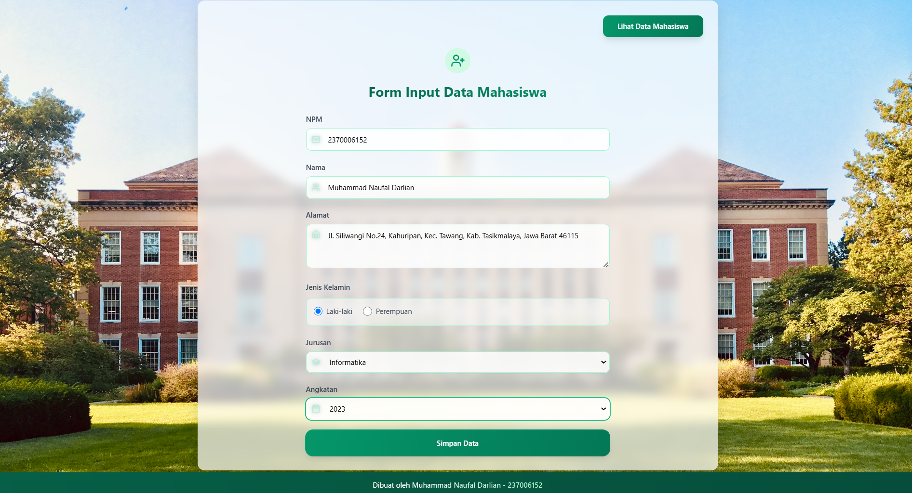

---

# 🎓 PEMW_DATA_MHSISWA

A modern web app to manage student data — built with cutting-edge technologies like **React**, **TypeScript**, **Vite**, and **Tailwind CSS** for performance, clarity, and elegance.

---

## ✨ Features

- 🔐 **User Authentication** — Secure login system  
- 📋 **Student Directory** — View a full list of students  
- 📝 **Data Management** — Add, edit, and update student information  
- 📊 **Dashboard Overview** — Visual representation of student stats  

---

## 🧰 Tech Stack

| 🛠️ Technology   | 🔍 Description                              |
|-----------------|----------------------------------------------|
| **React**        | Frontend library for dynamic UIs            |
| **TypeScript**   | Adds static typing to JavaScript            |
| **Vite**         | Blazing-fast development & build tool       |
| **Tailwind CSS** | Utility-first styling for rapid UI building |
| **ESLint**       | Linter for maintaining clean, error-free code |

---

## 🚀 Getting Started

### 📥 1. Clone the Repository
```bash
git clone https://github.com/username/PEMWEB_DATA_MAHASISWA.git
cd PEMWEB_DATA_MAHASISWA
```

### 📦 2. Install Dependencies
```bash
npm install
```

### 🧪 3. Run the Development Server
```bash
npm run dev
```

### 🌐 4. Visit the App
Open your browser and go to:  
[http://localhost:5173](http://localhost:5173)

---

## 🖼️ Application Interface

> 📸 Below are some preview screenshots of the app in action:

<p align="center">
  
</p>
<p align="center">
  
</p>
<p align="center">
  
</p>

---

## 🤝 Contributing

Have an idea or improvement? Contributions are welcome!  
Just **fork**, **create a branch**, and submit a **pull request**.

---

## 📄 License

This project is licensed under the [MIT License](LICENSE).  
Free to use, modify, and distribute.

---

> Crafted with ❤️ as part of a learning journey in web development.

---
